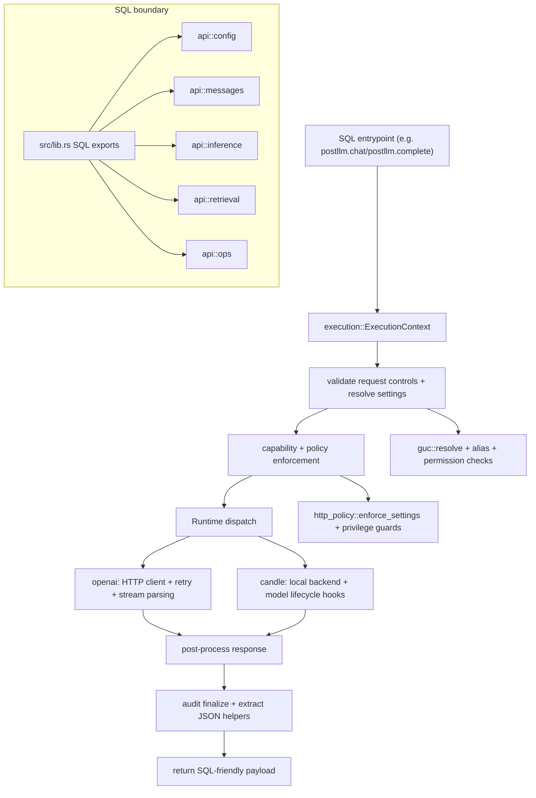

# Architecture Overview

This page gives a one-screen mental model of request flow and ownership boundaries.

## Current boundaries

- `src/lib.rs` registers SQL functions and keeps extension SQL metadata.
- `src/api/mod.rs` owns API namespacing (`api::config`, `api::messages`, `api::inference`, `api::retrieval`, `api::ops`).
- `src/api/config.rs` implements `api::config`.
- `src/api/messages.rs` implements `api::messages`.
- `src/api/inference.rs` implements `api::inference`.
- `src/api/retrieval.rs` implements `api::retrieval`.
- `src/api/ops.rs` implements `api::ops`.
- `src/backend.rs` centralizes request types, capability metadata, and settings model.
- `src/execution.rs` owns the shared request lifecycle for generation, streaming, embeddings, and reranking.
- `src/guc.rs` resolves and validates runtime/configuration state.
- `src/permissions.rs` and `src/operator_policy.rs` hold governance rules.
- `src/client.rs` and `src/candle.rs` implement HTTP/local runtime transport and execution.
- `src/http_policy.rs`, `src/secrets.rs`, `src/catalog.rs` handle security and metadata helpers.

## Design notes for maintainers

Keep this structure when adding features:

1. Add or extend the request option type first.
2. Route shared request setup through `src/execution.rs` instead of re-implementing it in each entrypoint.
3. Resolve and validate settings once, in one place.
4. Apply policy checks before runtime execution.
5. Keep SQL entrypoints thin and delegate behavior to internal helpers.
6. Add a tiny API entrypoint function for each new SQL helper within the relevant `api::*` module.
