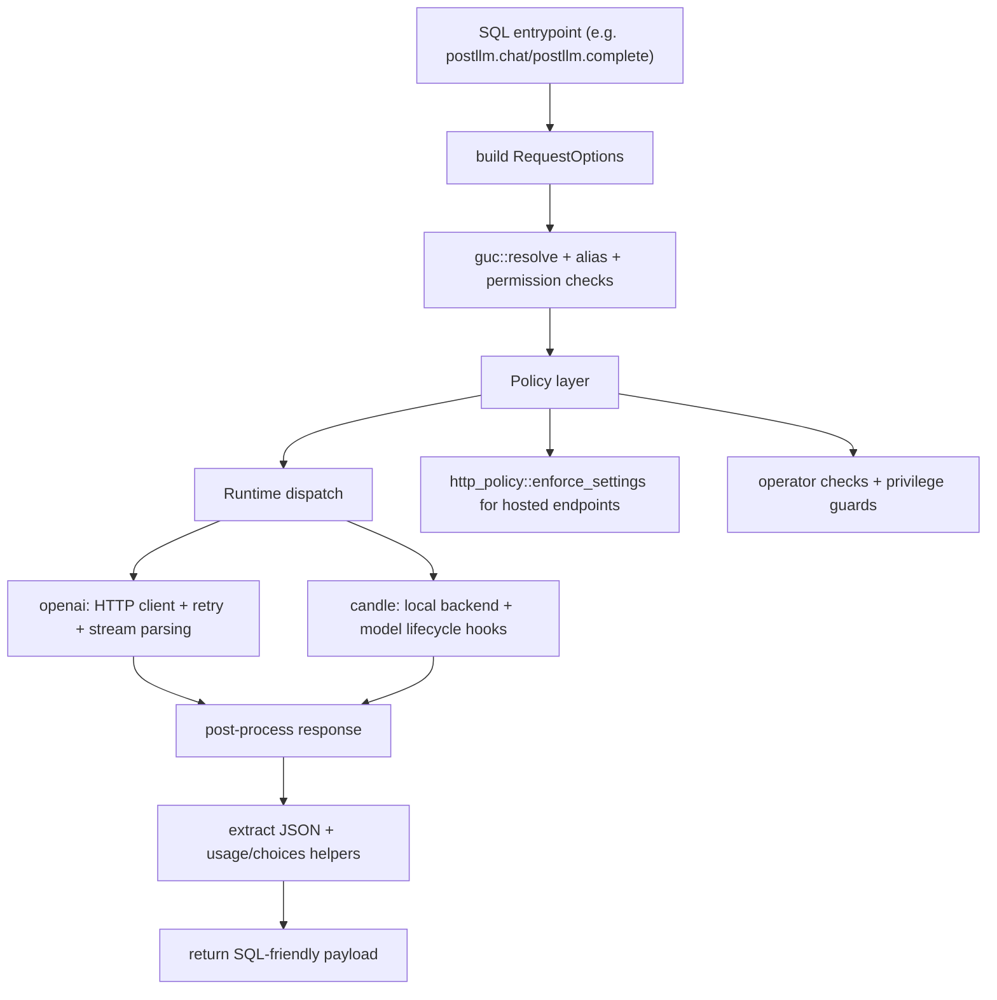

# Architecture Overview

This page gives a one-screen mental model of request flow and where policies are enforced.

## Current boundaries

- `src/lib.rs` registers SQL functions and keeps extension SQL metadata.
- `src/backend.rs` centralizes request types, capability metadata, and settings model.
- `src/guc.rs` resolves and validates runtime/configuration state.
- `src/permissions.rs` and `src/operator_policy.rs` hold governance rules.
- `src/client.rs` and `src/candle.rs` implement backend transport and runtime-specific execution.
- `src/http_policy.rs`, `src/secrets.rs`, `src/catalog.rs` handle security and metadata helpers.

## Design notes for maintainers

Keep the same shape when adding features:

1. Add/extend a request option type first.
2. Resolve and validate configuration once.
3. Apply policy checks in one location before runtime execution.
4. Keep SQL wrappers thin and delegate cross-cutting behavior to internal helpers.
